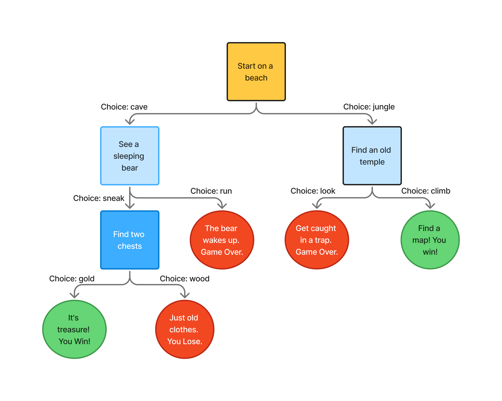

# The Treasure Hunt
🌴 The Treasure Hunt 🌴 A simple "Choose Your Own Adventure" game written in Python. Will you find the treasure or get caught by the bear? 🐻

## Decision tree for the game!


## How to Play

1.  Make sure you have Python 3 installed on your computer.
2.  Clone or download this repository to your machine.
3.  Open your terminal (or command prompt).
4.  Navigate into the folder containing the game file.
5.  Run the game by typing:
    ```bash
    python treasure_hunt.py
    ```
    (You might need to replace `treasure_hunt.py` with the name of your Python file.)
6.  The game will start\! First, it will ask for your name.
7.  Read the story prompts and make your decisions by typing one of the choices (like `jungle` or `sneak`) and pressing **Enter**.
8.  Your choices will determine the outcome. Try to find the treasure and win the game\!
